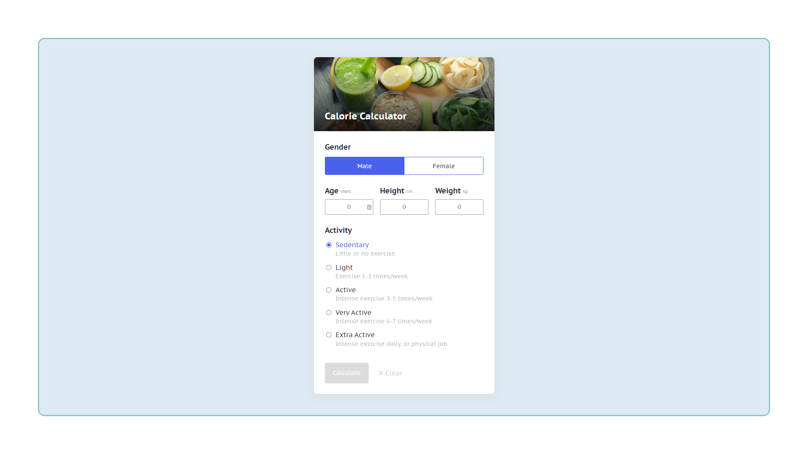

# Calorie Calculator

A vanilla JavaScript app to calculate how many calories you need to eat per day to maintain/lose weight. 
Try out now on 👉🏼 https://fightm9.github.io/calorie-calculator/

# 🥕 Simple Calorie Calculator

The Calorie Calculator project is simply in HTML, CSS, and JavaScript. You can calculate your daily caloric needs to maintain or lose weight. You just have to type your age, gender, weight, height, and exercise activity and click on the calculate button to find out the calories required per day. 

## Features

- 😉 Minimalistic UI 
- ✅ Focus on accessibility
- 📱 Tablet & mobile friendly

## Screenshot

## Technologies Used 

- Vanilla JavaScript
- CSS
- HTML

